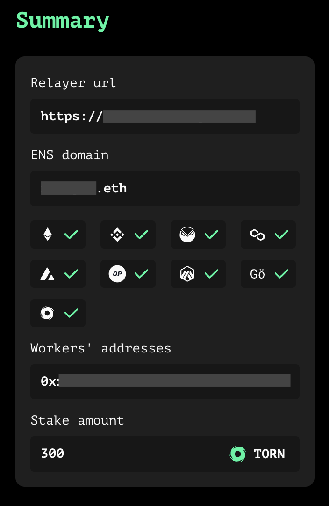

# ¿Cómo convertirse en un repetidor?


25 de febrero de 2022 - Información\
Esta función aún no está disponible en la interfaz de usuario de Tornado Cash.\
\
(solo unos dias de espera.. :cloud\_tornado:)


Tras la ejecución de la [propuesta de Tornado Cash 10th de gobernanza](https://tornadocash.eth.link/governance/10), cualquiera se puede convertir en repetidor para los usuarios de Tornado Cash.


La única condición para que sea incluido en la interfaz de usuario de Tornado Cash es mantener un min. de `300 TORN`. Esta participación mínima se puede cambiar mediante un voto de gobernanza en cualquier momento.


Los repetidores forman una parte esencial y necesaria del ecosistema de Tornado Cash. Su uso garantiza la privacidad ya que resuelven el infame "dilema de pago de tarifas": ¿cómo pagar tarifas por retiros de tokens de un pool mientras se mantiene el anonimato?

Por lo tanto, los repetidores actúan como terceros y se encargan de todo el retiro. Pagan las tarifas de transacción deduciéndolas directamente del monto transferido. También cobran una tarifa adicional por sus servicios.

Desde la [Propuesta de registro de repetidores](https://tornadocash.eth.link/governance/10), el protocolo cobrará una tarifa directamente del saldo en staking del retransmisor a través del contrato `StakingReward` por cada retiro. Este porcentaje de tarifa puede variar de un pool a otro y también está sujeto a cambios a través de la gobernanza en la blockchain.

Está fijado en **** `0.3%` por ahora. Algunos pools permanecen sin tarifas, ya sea porque la instancia es demasiado pequeña para asignar una tarifa (0.1 ETH, 100 DAI/USDT, 1000 DAI/USDT), o porque no hay suficiente liquidez en Uni v3 (todas las instancias de cDAI).

## ¿Cómo convertirse en un repetidor?

Cualquiera puede convertirse en retransmisor del protocolo en **6 sencillos pasos** a través de una interfaz de usuario (UI) de registro de retransmisores.

Abajo encontrarás todo lo que necesitas para unirte a nuestro club de repetidores y para ser incluido en el registro de repetidores descentralizados de Tornado Cash.

### 1. Requisitos: ser consciente y aceptar los riesgos potenciales

Antes de comprometerte a compartir parte de tu viaje con los usuarios de Tornado Cash como repetidor, debes ser consciente y aceptar todos los riesgos potenciales de ser un repetidor del protocolo.

### 2. Configurar repetidor

El primer paso concreto es ejecutar el software de Tornado Cash Relayer para Ethereum Mainnet en tu computadora. Todos los pasos se explican en el github del protocolo. Para completar esta tarea con éxito, debes seguir cuidadosamente [estas instrucciones](https://github.com/tornadocash/tornado-relayer#deploy-with-docker-compose).



Una vez que termines, tienes insertar tu URL en casilla.

### 3. Configurar subdominio ENS

El siguiente paso consiste en:

* Creación de un dominio ENS para tu repetidor,
* Configuración de tu subdominio en mainnet,
* Agregar un registro TXT con la URL del repetidor (Relayer) al subdominio de la red principal de acuerdo con este formato:

#### Retransmisores de Ethereum (Obligatorio)

| TXT record              |
| ----------------------- |
| mainnet-tornado.xxx.eth |
| goerli-tornado.xxx.eth  |

#### **Retransmisores de blockchains laterales (opcional)**

También tienes la posibilidad de agregar subdominios con sus correspondientes registros TXT para soportar otras blockchains además de Ethereum. Los retransmisores de blockchains laterales utilizan una versión diferente del software Retransmisor. Tienes todas las instrucciones necesarias para hacerlo [aquí](https://github.com/tornadocash/tornado-relayer/blob/light/README.md).

| TXT record                |
| ------------------------- |
| bsc-tornado.xxx.eth       |
| gnosis-tornado.xxx.eth    |
| polygon-tornado.xxx.eth   |
| optimism-tornado.xxx.eth  |
| arbitrum-tornado.xxx.eth  |
| avalanche-tornado.xxx.eth |

#### Repetidor Nova (opcional)

Tornado Cash Nova utiliza su propia versión del software. Si quieres convertirse en retransmisor de Tornado Cash Nova, encontrarásinstrucciones [aquí](https://github.com/tornadocash/tornado-pool-relayer#deploy-with-docker-compose).

| TXT record          |
| ------------------- |
| gnosis-nova.xxx.eth |

#### 4. Configurar trabajadores

Los trabajadores son las direcciones que permitirán que tu repetidor envíe pruebas ZK a los usuarios. De forma predeterminada, el primer trabajador es la dirección del propietario del dominio ENS.

Para garantizar un nivel adicional de seguridad, te recomendamos configurar más de un trabajador.

Solo la red principal requiere que registre trabajadores. Todas las demás redes no requieren el uso de trabajadores registrados.

.png>)

#### 5. Stake

Con la implementación de un registro de repetidores descentralizados, se introdujo una condición de staking para que se incluya en la interfaz de usuario de Tornado Cash. De hecho, **ahora es necesario agregar TORN a la lista recomendada de repetidores.**

La gobernanza de Tornado Cash establece actualmente la cantidad mínima en staking de **`300 TORN`**. Con la gobernanza de Tornado Cash se puede cambiar este umbral en cualquier momento.

Cuando se utiliza un repetidor en un pool de Tornado Cash, el contrato `StakingReward` recoge automáticamente una pequeña cantidad de TORN de este saldo en staking. Es esencial tener en cuenta este elemento, ya que los relevos deberán mantener su saldo en staking por encima de `300 TORN` en todo momento.

Estas tarifas recaudadas se distribuyen posteriormente entre los miembros del DAO que tienen sus tokens TORN bloqueados. TORN generalmente está bloqueado para participar en la gobernanza en la blockchain (sugerir y votar propuestas). Puedes encontrar más información en este [mensaje del foro](https://torn.community/t/proposal-relayer-registry-setting-parameters-after-audit/2134) y en la [Página de documentación de staking de TORN](staking.md).


Tu TORN en staking no es reclamable y no es reembolsable.


#### 6. Resumen: última verificación y registro

Por último, pero no menos importante, te recomendamos que **verifiques dos veces toda la información** presente en el Resumen antes de registrarte.

_¡Bienvenido al equipo de repetidores! Gracias a ti, la privacidad se puede respetar mejor._ 💚

_Escrito por_ [_**@bt11ba**_](https://torn.community/u/bt11ba/) _**** &_ [_**@ayefda**_](https://torn.community/u/ayefda)****
